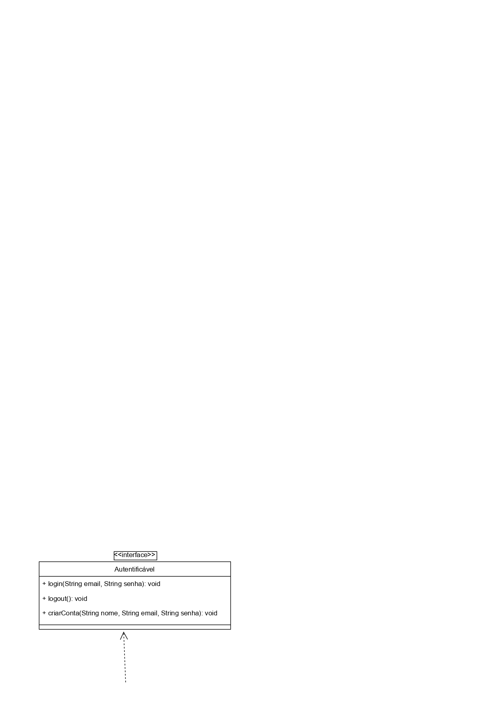
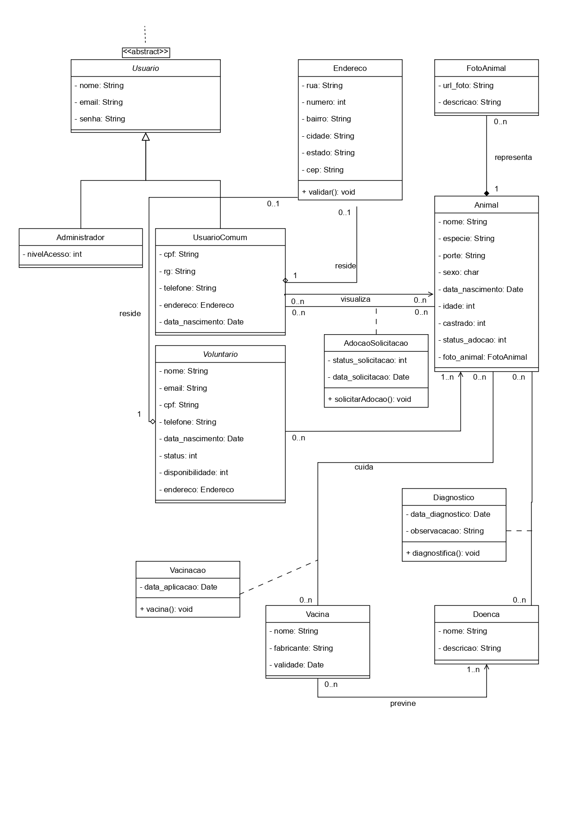

# 🐾 Amigo das Patinhas - Sistema de Adoção Animal

Este projeto é um sistema para gerenciar um abrigo de animais, com funcionalidades como cadastro de usuários, controle de vacinas, diagnósticos, solicitações de adoção e gerenciamento do sistema. Ele também serve como exemplo didático para os principais conceitos de **Programação Orientada a Objetos (POO)** em Java.

---

## 📖 Conceitos de POO aplicados

O código demonstra claramente os seguintes conceitos:

---

### 🧬 1. Herança
Herança permite que classes compartilhem atributos e métodos de uma classe base.

- A classe abstrata `Usuario` contém atributos e comportamentos comuns (nome, email, senha, autenticação).
- As classes `Administrador` e `UsuarioComum` **herdam** de `Usuario`, reutilizando esses métodos e atributos.

Exemplo:
public abstract class Usuario implements Autenticavel { ... }

public class Administrador extends Usuario { ... }

public class UsuarioComum extends Usuario { ... }

### ❌🧱 2. Classe Abstrata
A classe Usuario é abstrata porque define uma estrutura base para todos os usuários, mas não pode ser instanciada diretamente.

Ela fornece uma implementação padrão para os métodos da interface Autenticavel.

Serve como modelo para as subclasses.

### 🤝 3. Interface
A interface Autenticavel define um contrato que todas as classes que a implementam devem cumprir.

Métodos obrigatórios: login(), logout(), criarConta().

A classe Usuario implementa a interface e garante que todas as subclasses também obedeçam esse contrato.

### 🎭 4. Polimorfismo
Polimorfismo acontece quando uma subclasse modifica (sobrescreve) o comportamento herdado da super classe.

A classe Administrador sobrescreve o método criarConta() para gerar um número autenticador ao criar uma conta.

Apesar de criarConta() ser definido em Usuario, o comportamento é diferente para o administrador.

## 🐶 Pacote animais
O pacote br.com.amigodaspatinhas.animais modela o domínio do sistema, com todas as classes relacionadas aos animais do abrigo:

| Classe               | Descrição                                                                 |
|-----------------------|----------------------------------------------------------------------------|
| `Animal`             | Representa um animal com nome, espécie, porte, sexo, idade e status.      |
| `FotoAnimal`         | Armazena URL e descrição da foto do animal.                               |
| `AdocaoSolicitacao`  | Gerencia solicitações de adoção com status (Pendente, Aprovado, Rejeitado).|
| `Vacina`             | Representa uma vacina com nome, fabricante e validade.                    |
| `Vacinacao`          | Registra a aplicação de vacinas.                                          |
| `Doenca`             | Representa doenças que podem ser diagnosticadas nos animais.              |
| `Diagnostico`        | Contém observações e datas dos diagnósticos realizados.                   |

---

## 🗂️ Estrutura do Projeto
```text
br/com/amigodaspatinhas/
├── Main.java                  # Classe principal para simulação
├── autenticacao/
│   └── Autenticavel.java      # Interface para autenticação
├── usuarios/
│   ├── Usuario.java           # Classe abstrata
│   ├── Administrador.java     # Herda Usuario
│   ├── UsuarioComum.java      # Herda Usuario
│   └── Voluntario.java        # Classe independente
├── animais/
│   ├── Animal.java            # Classe Animal
│   ├── FotoAnimal.java        # Classe Foto do animal
│   ├── AdocaoSolicitacao.java # Solicitação de adoção
│   ├── Doenca.java            # Doenças
│   ├── Diagnostico.java       # Diagnóstico
│   ├── Vacina.java            # Vacina
│   └── Vacinacao.java         # Vacinacao
└── util/
    └── Endereco.java          # Classe para endereços
```
## 📄 Diagrama de Classes


